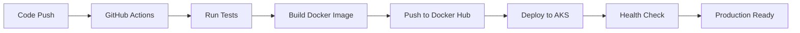

# 🏗️ Cloud Computing Deployment Pipeline - Project Overview

## 📋 Project Summary
Complete Inventory Management System with full CI/CD pipeline from local development to Azure Kubernetes Service (AKS) deployment.

## 🎯 Features Implemented
- ✅ **CRUD Operations**: Create, Read, Update, Delete inventory items
- ✅ **Modern Frontend**: Responsive HTML/CSS/JavaScript interface
- ✅ **RESTful API**: Node.js/Express backend with MongoDB
- ✅ **Containerization**: Docker with multi-stage builds and health checks
- ✅ **Cloud Deployment**: Azure Kubernetes Service (AKS) with auto-scaling
- ✅ **CI/CD Pipeline**: GitHub Actions for automated deployment
- ✅ **Container Registry**: Docker Hub integration
- ✅ **Infrastructure as Code**: Kubernetes manifests for reproducible deployments

## 📁 Project Structure
```
inventory-management-system/
├── 📄 README.md                    # Project documentation
├── 📄 package.json                 # Node.js dependencies and scripts
├── 📄 server.js                    # Express.js backend server
├── 📄 Dockerfile                   # Container configuration
├── 📄 .dockerignore                # Docker build exclusions
├── 📄 healthcheck.js               # Container health check script
├── 📄 .env.example                 # Environment variables template
├── 📄 .gitignore                   # Git exclusions
├── 📄 PROJECT-OVERVIEW.md           # This file
│
├── 📁 public/                      # Frontend assets
│   ├── 📄 index.html               # Main HTML interface
│   ├── 📄 styles.css               # Responsive CSS styling
│   └── 📄 script.js                # Frontend JavaScript logic
│
├── 📁 k8s/                         # Kubernetes manifests
│   ├── 📄 namespace.yaml           # Kubernetes namespace
│   ├── 📄 mongodb-deployment.yaml  # MongoDB deployment & service
│   ├── 📄 app-deployment.yaml      # Application deployment & service
│   └── 📄 ingress.yaml             # Ingress configuration
│
├── 📁 .github/workflows/           # CI/CD pipeline
│   └── 📄 ci-cd.yml                # GitHub Actions workflow
│
├── 📁 scripts/                     # Deployment automation
│   ├── 📄 local-dev.sh             # Local development setup
│   └── 📄 deploy.sh                # Cloud deployment script
│
└── 📁 docs/                        # Documentation
    ├── 📄 DEPLOYMENT.md             # Comprehensive deployment guide
    └── 📄 API.md                    # API documentation
```

## 🚀 Pipeline Stages

### 1. **Local Development & Testing**
- Node.js application with Express framework
- MongoDB database integration
- Responsive web interface
- Local development server with hot reload

### 2. **Containerization**
- Multi-stage Docker build for optimization
- Health check implementation
- Security best practices (non-root user)
- Minimal Alpine Linux base image

### 3. **Image Publishing**
- Automated Docker Hub publishing
- Image tagging with Git SHA
- Build caching for faster deployments
- Security scanning integration ready

### 4. **Cloud Deployment (Azure AKS)**
- Kubernetes cluster provisioning
- MongoDB StatefulSet with persistent storage
- Application deployment with 3 replicas
- LoadBalancer service for external access
- Ingress controller for domain routing

### 5. **Version Control & CI/CD**
- GitHub repository with branch protection
- Automated testing on pull requests
- Continuous deployment on main branch
- Rollback capabilities
- Environment-specific configurations

## 🛠️ Technology Stack

### **Frontend**
- **HTML5**: Semantic markup with accessibility features
- **CSS3**: Responsive design with Flexbox/Grid
- **JavaScript (ES6+)**: Modern async/await patterns
- **Fetch API**: RESTful API communication

### **Backend**
- **Node.js**: Runtime environment
- **Express.js**: Web framework
- **MongoDB**: NoSQL database
- **Mongoose**: ODM for MongoDB

### **DevOps & Infrastructure**
- **Docker**: Containerization platform
- **Kubernetes**: Container orchestration
- **Azure AKS**: Managed Kubernetes service
- **GitHub Actions**: CI/CD automation
- **Docker Hub**: Container registry

### **Monitoring & Observability**
- Health check endpoints
- Kubernetes probes (liveness/readiness)
- Azure Monitor integration ready
- Structured logging implementation

## 🎮 Quick Start Commands

### **Local Development**
```bash
# Setup and start local environment
chmod +x scripts/local-dev.sh
./scripts/local-dev.sh

# Manual setup
npm install
docker run -d --name mongodb-local -p 27017:27017 mongo:7.0
cp .env.example .env
npm run dev
```

### **Docker Deployment**
```bash
# Build and run with Docker Compose
docker build -t inventory-app .
docker run -d --name mongodb -p 27017:27017 mongo:7.0
docker run -d -p 3000:3000 --link mongodb:mongodb inventory-app
```

### **Cloud Deployment**
```bash
# Automated deployment to Azure AKS
chmod +x scripts/deploy.sh
./scripts/deploy.sh

# Manual Kubernetes deployment
kubectl apply -f k8s/
kubectl get services -n inventory-system
```

## 📊 Application Features

### **Inventory Management Operations**
1. **Create Items**: Add new inventory with validation
2. **View Items**: Display all items in responsive grid
3. **Update Items**: Edit existing item details
4. **Delete Items**: Remove items with confirmation
5. **Search & Filter**: Category-based filtering
6. **Real-time Updates**: Automatic refresh capabilities

### **Data Model**
```javascript
{
  name: String,           // Product name
  description: String,    // Product description  
  quantity: Number,       // Stock quantity (≥ 0)
  price: Number,         // Price in USD (≥ 0)
  category: String,      // Product category
  createdAt: Date,       // Creation timestamp
  updatedAt: Date        // Last update timestamp
}
```

## 🔧 Configuration & Secrets

### **Required GitHub Secrets**
- `DOCKERHUB_USERNAME`: Docker Hub username
- `DOCKERHUB_TOKEN`: Docker Hub access token
- `AZURE_CREDENTIALS`: Azure service principal JSON

### **Environment Variables**
- `NODE_ENV`: Environment (development/production)
- `PORT`: Application port (default: 3000)
- `MONGODB_URI`: MongoDB connection string

## 🚦 Deployment Pipeline Flow



## 📈 Scalability & Performance

### **Horizontal Scaling**
- Kubernetes HPA (Horizontal Pod Autoscaler) ready
- LoadBalancer distributes traffic across replicas
- Stateless application design

### **Database Scaling**
- MongoDB replica set configuration available
- Persistent volume claims for data persistence
- Backup and restore procedures documented

### **Monitoring Ready**
- Health check endpoints implemented
- Kubernetes probes configured
- Azure Monitor integration points available

## 🔒 Security Features

### **Container Security**
- Non-root user execution
- Minimal base image (Alpine Linux)
- Security scanning ready
- Resource limits configured

### **Kubernetes Security**
- Namespace isolation
- Network policies ready
- RBAC configuration available
- Secrets management for sensitive data

## 🎯 Production Readiness Checklist

- ✅ **Application**: CRUD operations working
- ✅ **Frontend**: Responsive design implemented
- ✅ **Backend**: RESTful API with validation
- ✅ **Database**: MongoDB with proper schema
- ✅ **Containerization**: Docker with health checks
- ✅ **Orchestration**: Kubernetes manifests
- ✅ **CI/CD**: GitHub Actions pipeline
- ✅ **Documentation**: Comprehensive guides
- ✅ **Scripts**: Automated deployment tools
- ✅ **Monitoring**: Health check endpoints

## 🚀 Next Steps for Production

1. **SSL/TLS**: Configure HTTPS with Let's Encrypt
2. **Authentication**: Implement JWT or OAuth2
3. **Rate Limiting**: Add API rate limiting
4. **Caching**: Implement Redis for performance
5. **Monitoring**: Set up Prometheus/Grafana
6. **Backup**: Automated database backups
7. **CDN**: Static asset delivery optimization

## 📞 Support & Maintenance

### **Troubleshooting**
- Check application logs: `kubectl logs -f deployment/inventory-app -n inventory-system`
- Monitor pod status: `kubectl get pods -n inventory-system`
- Access application shell: `kubectl exec -it <pod-name> -n inventory-system -- /bin/sh`

### **Updates & Rollbacks**
- Update deployment: `kubectl set image deployment/inventory-app inventory-app=new-image`
- Rollback: `kubectl rollout undo deployment/inventory-app -n inventory-system`
- Scale replicas: `kubectl scale deployment inventory-app --replicas=5 -n inventory-system`

---

**🎉 Project Status**: ✅ **COMPLETE** - Ready for deployment and production use!